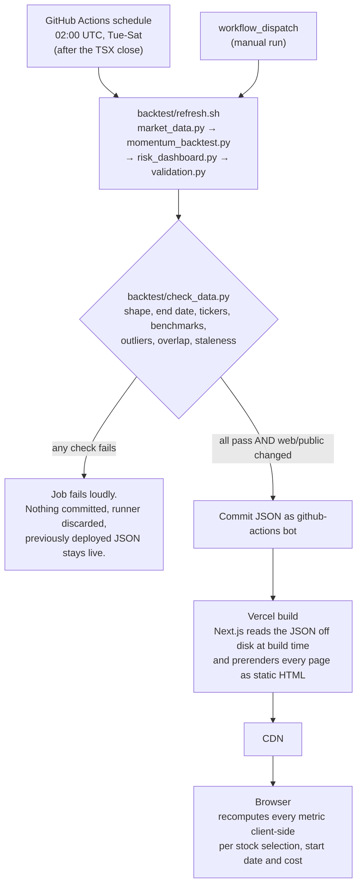

# QuantRisk

Backtesting, risk analytics and model validation for Canadian large-cap
stocks — built to test whether its own models are right, not just to compute
them.

**[Live site][live]** · [Model documentation](./MODEL_DOCUMENTATION.md)


*The Model Validation tab backtesting its own VaR model — the red dots are
days the actual loss exceeded the model's forecast.*

<!-- TODO: add a home-page screenshot at docs/screenshots/home.png and
     embed it here, above the VaR chart:
      -->

**This is not investment advice**, not a production risk system, and not
wired up for live trading. See [Limitations](#limitations) and
[`MODEL_DOCUMENTATION.md`](./MODEL_DOCUMENTATION.md) before treating anything
here as more than a demonstration.

## What it does

Three tabs over one Python-to-JSON pipeline. Every metric is recomputed in
the browser for whatever stocks, start date and cost assumption you pick.

- **Strategies** — five rules (1-day momentum, 12-month momentum, mean
  reversion, low volatility, buy-and-hold) over ~51 stocks,
  measured against both an equal-weight Buy & Hold of the same names and two
  passive CAD index ETFs (S&P/TSX 60, unhedged S&P 500). Includes a
  risk-adjusted table (CAGR, volatility, Sharpe, max drawdown, annualized
  turnover) and a cost-sensitivity panel giving each strategy's total return
  across a range of transaction costs plus the break-even cost at which its
  edge disappears.
- **Risk Dashboard** — volatility, Sharpe, max drawdown, historical VaR
  and Expected Shortfall, CAPM beta/alpha, a correlation
  heatmap, rolling time-varying risk metrics, a Monte Carlo projection, and
  a long-only efficient frontier (minimum-variance and max-Sharpe).
- **Model Validation** — computes no new metrics; it checks whether the
  ones above can be trusted. Out-of-sample VaR
  backtesting with the Kupiec, Christoffersen and conditional-coverage
  likelihood-ratio tests, the Basel traffic light on real 250-observation
  windows, and four historical crises replayed with portfolio weights
  estimated strictly before each one opened.

## Key findings

Every figure below is stamped with the data vintage and the stock selection
it came from, because both matter and both change: the data refreshes each
weeknight, and the answers genuinely differ by selection. **The live site is
the source of truth** — it recomputes all of this from current data.
`MODEL_DOCUMENTATION.md` §5 carries the full tables.

- **VaR breaches arrive at the right rate but at the wrong times — at 95%.**
  *As of 2026-09-28, Sector-Diverse default preset (RY/ENB/CNR/BCE/ABX).*
  Kupiec (coverage) passes for historical VaR at both confidence levels
  (p = 0.63 at 95%, p = 0.50 at 99%), but Christoffersen (independence)
  **rejects at 95% for both methods** (p = 0.0237 historical, p = 0.0344
  parametric): breaches cluster in volatile stretches instead of scattering
  independently. This holds across every selection tested — all six 95%
  series reject. At 99% it now *passes* on both five-stock presets while
  still rejecting on the full 51-stock equal-weight portfolio, and with only
  7–21 exceptions in the 99% tail that pass is weak evidence rather than a
  clean result. This claim was previously overstated; see
  [Methodology corrections](#methodology-corrections).

- **Assuming Normal returns breaches the 99% threshold about twice as often
  as it should.** *As of 2026-09-28, Sector-Diverse default.* Parametric
  99% VaR is breached on **2.09%** of days against its nominal 1%, and
  Kupiec rejects it outright (p = 0.0025). Historical VaR, which assumes no
  distribution at all, sits at 0.80% on the same data. Measured excess
  kurtosis on the full universe is **4.15** (a normal distribution has 0).
  The failure is the Normality assumption, not the VaR framework.

- **Diversification shrank exactly when it was needed.** *Sector-Diverse
  default, over the fixed 2005–2022 stress dataset.* Average pairwise
  correlation runs **0.222** outside the crisis windows and reaches
  **0.590** during the COVID crash (+0.368). It rose in all four crises.
  A portfolio that looks diversified in calm periods behaved like a far more
  concentrated one when it mattered.

- **The "optimal" portfolio lost to the naive one in three of four crises.**
  *Sector-Diverse default.* Max-Sharpe weights, estimated out-of-sample from
  the three years before each window and then held fixed through it,
  underperformed a plain equal-weight blend of the same five stocks in the
  2008 GFC (−4.4 pts), the COVID crash (−0.3 pts) and the 2022 rate-hike
  selloff (−1.9 pts), beating it only in the oil crash (+8.2 pts). This is
  mean-variance estimation error showing up in real data.

- **One strategy's entire edge is a transaction-cost artifact.**
  *As of 2026-09-28, full 5-year window, all 51 tickers.* 1-Day Momentum
  returns **+188.1% gross** (0 bps) and **−56.9% net** at the 10 bps
  baseline, because it turns the whole basket over roughly 380× a year. Its
  break-even cost — where it ties Buy & Hold — is **0.9 bps**, which no
  retail investor pays. 12-Month Momentum, rebalancing monthly at 4.6×
  turnover, breaks even at **125.8 bps** and is the only active strategy
  with an edge that survives realistic costs.

## Architecture



**Why there is no database.** The dataset is small (~5.6 MB of JSON),
read-only, written by exactly one process once a day, and identical for
every visitor. Those four properties are precisely the case where a database
buys nothing: there are no per-user writes to serialize, no queries that a
CDN edge cache cannot already answer, and no consistency problem to solve.
Static files plus a CDN are faster, free, and have no connection pool to
exhaust or credentials to rotate. Metrics are computed in the browser rather
than server-side so the start-date and selection controls respond instantly
without a round trip.

A database becomes necessary the moment the universe stops being fixed — if
a visitor can type in an arbitrary ticker, the data is no longer a small
precomputable set and the one-download-fits-all model breaks. That is on the
[roadmap](#roadmap) as a DuckDB layer.

## Automated refresh and safety checks

[`.github/workflows/refresh-data.yml`](./.github/workflows/refresh-data.yml)
runs weeknights at 02:00 UTC — about six hours after the TSX close — and can
also be triggered by hand. It regenerates the JSON, then puts it through
[`backtest/check_data.py`](./backtest/check_data.py), which compares every
file against the version currently committed and fails on any of:

| Check | What it catches |
|---|---|
| Parses, and top-level keys unchanged | A truncated write, or a schema change nobody intended |
| End date never moves backwards | New data must extend the series, never truncate it |
| No ticker disappears, count never shrinks | The download pipeline silently drops names with thin coverage |
| CAPM and index benchmarks present, covering the new dates | A benchmark that stops updating breaks beta/alpha and the chart quietly |
| No new daily return exceeds ±40% | A missed split or a bad print |
| Overlap consistency on shared dates | Compares **returns**, not prices — `auto_adjust=True` restates past closes after every dividend, so prices legitimately move while returns do not. A small mismatch fraction is tolerated and always reported |
| Staleness: end date within 4 business days of today | Yahoo silently returning last week's window, which is otherwise indistinguishable from a market holiday |

**If anything fails, nothing is committed.** The job exits non-zero, the
runner is discarded, and the previously deployed data stays live untouched —
a failed refresh degrades to stale-but-correct rather than to broken. The
commit step additionally skips when `web/public` is unchanged, so market
holidays produce no empty commits.

`stress_data.py` is deliberately excluded from the nightly run: its four
crisis windows have fixed historical dates and cannot change, so
re-downloading twenty years of history every night would add failure surface
and nothing else. It is run by hand when the universe or benchmark changes.

Because a failed refresh is silent by design, the footer carries a
**client-side staleness badge**: it compares the data's end date against the
viewer's own clock and shows a warning past four business days. It has to be
client-side — the site only rebuilds when a refresh *succeeds*, so a
build-time check would never fire on the one day it matters.

## Methodology corrections

Errors found in my own work, kept here rather than quietly fixed. Full
detail in `MODEL_DOCUMENTATION.md` §5–§6.

**Basel traffic light was averaging away the thing it measures.**
*What was wrong:* the total exception count over the whole backtest was
rescaled to a 250-day equivalent (10 exceptions in 1005 days → 2.5 → green).
*Why it mattered:* the Basel test is defined on the most recent 250
observations, and averaging over ~1000 days deliberately smooths out
clustering — the exact property the Christoffersen test rejects on this same
data. The display could show green while a real 250-day window sat in yellow
or red. *Fix:* both the TypeScript implementation and the Python reference
now count actual 250-observation windows, and additionally report the worst
such window anywhere in the backtest. On current data the Big 5 Banks
selection shows green trailing and **yellow** worst — the divergence the old
method hid.

**A price-index benchmark was inflating every alpha.**
*What was wrong:* CAPM beta/alpha were regressed against `^GSPTSE`, the
S&P/TSX Composite, which is a price index and excludes dividends. Stock
returns here come from dividend-adjusted closes and include them.
*Why it mattered:* alpha is by definition the return the benchmark cannot
explain, so the benchmark's entire missing dividend yield was being credited
to the stock as skill — a bias running in the flattering direction, on the
one number that claims to measure skill. *Fix:* the benchmark is now
`XIU.TO` (iShares S&P/TSX 60), a total-return ETF on the same
dividend-inclusive basis, which also tracks the index this universe is drawn
from. On the sector-diverse default, portfolio alpha fell from **+2.77% to
+0.83%** (−1.94 pts) — close to the `beta × dividend yield` the mechanism
predicts. `check_data.py` now reads the benchmark from `config.py` instead
of hardcoding it, so this class of drift fails the nightly job.

**The default stock selection made the diversification results degenerate.**
*What was wrong:* the default was the five big Canadian banks, averaging
0.739 pairwise correlation. *Why it mattered:* the efficient frontier
collapsed toward a line, the correlation heatmap was uniformly hot, and the
diversification sections looked broken on first load — there was essentially
nothing to diversify. *Fix:* the default is now five distinct sectors
averaging 0.222. The banks remain as an explicitly-labelled concentration
demo, where high correlation is the point.

**The headline Christoffersen claim was overstated.**
*What was wrong:* this README and `MODEL_DOCUMENTATION.md` both said the VaR
model "fails the Christoffersen test in all four method/confidence
combinations." *Why it mattered:* it was only ever checked against the full
51-stock equal-weight portfolio, and stated as though it held everywhere —
overclaiming a real finding is the same error as hiding one. *Fix:* the
claim is now reported per selection and per confidence level. Clustering at
95% holds across every selection tested; at 99% it now passes on both
five-stock presets while still rejecting on the full universe, and the write-up
says so, including the caveat that the 99% tail has too few exceptions for
the test to have much power.

## Running it locally

Requires Python 3.14 (matching the version pinned in CI) and Node 18+.

**Pull first.** A bot commits regenerated data every weeknight, so a stale
local clone will conflict with it.

```bash
git pull

cd backtest
python3 -m venv venv
source venv/bin/activate
pip install -r requirements.txt

./refresh.sh          # market_data -> momentum_backtest -> risk_dashboard -> validation
python check_data.py  # the same safety checks CI runs, against the committed JSON
```

`refresh.sh` runs the four daily scripts in dependency order from inside
`backtest/` (they import each other by bare module name, so the working
directory matters). `validation.py` also prints a full console validation
report — the source of the numbers in `MODEL_DOCUMENTATION.md` §5.

`stress_data.py` is **not** part of `refresh.sh` and is run separately, only
when the universe or benchmark changes:

```bash
python stress_data.py   # a separate, longer 2005-2022 download
```

Then the frontend:

```bash
cd ../web
npm install
npm run dev
```

Open <http://localhost:3000>. Re-running the Python scripts and refreshing
the page is the entire update workflow; there is no build step in between.

## Limitations

Every feature states its own assumptions inline, on the page, next to the
numbers they affect. Two places collect the full picture:

- **[`MODEL_DOCUMENTATION.md`](./MODEL_DOCUMENTATION.md)** — methodology,
  assumptions and data limitations for every model here, plus the actual
  validation results **including the tests that failed** (§5) and a table of
  known deficiencies with what would fix them (§6).
- **The site's own Assumptions & Limitations page**,
  linked from the footer of every tab — grouped by data/model/implementation
  limitation, with the numbers read live from the generated JSON so they
  cannot silently drift out of sync with the data.

The short version: the stock universe carries real survivorship bias (today's
index membership applied backwards, so names that left the index are missing
entirely, which inflates strategies that rank and select more than it
inflates Buy & Hold); `yfinance` is an unofficial API with no SLA and no
fallback source; the efficient frontier and Monte Carlo assume the future
resembles a chosen historical window, which §5 shows is not quite true; and
there is no automated test suite — correctness rests on mutation tests and
closed-form cross-checks run by hand during development.

## Roadmap

- **GARCH-style conditional volatility** — the constant-variance assumption
  behind parametric VaR and Monte Carlo is the most direct response to the
  95% clustering finding above, and to the parametric 99% over-breaching.
- **DuckDB layer and arbitrary tickers** — lets a visitor analyse any ticker
  rather than a fixed 51-name universe. This is the change that makes a
  query engine necessary; see [Architecture](#architecture).
- **Shrinkage or Black-Litterman for the efficient frontier** — address the
  mean-return estimation error the stress tests already surface empirically.
- **More strategy variants** — 12-1 momentum (skipping the most recent month
  to avoid short-term reversal), and inverse-volatility weighting as an
  alternative to equal weight.
- **Drawdown chart** on the Strategies tab, so the depth and duration of
  losses are visible alongside the equity curve rather than only as a
  single max-drawdown number.
- **A statistical test of the momentum edge** — 12-Month Momentum's
  outperformance is currently reported as a point estimate; a bootstrap or
  Newey-West t-test would say whether it survives sampling error, separately
  from whether it survives costs.
- **Multi-factor risk model** — replace the single-factor CAPM beta/alpha
  with something Fama-French-style.
- **Point-in-time index constituents** — would remove the survivorship bias
  above, if a suitable free source exists.
- **An automated test suite**, porting the ad hoc mutation and closed-form
  checks used during development into something that runs on every change.
- **Trim or lazy-load `stress_data.json`** — the Validation page currently
  ships ~2.9 MB of HTML because the full 2005–2022 dataset is inlined for
  client-side recomputation.

## Author

TODO: Your Name — [LinkedIn](TODO: https://www.linkedin.com/in/your-handle/)
· [GitHub](https://github.com/ccchwww) · TODO: your.email@example.com

<!-- The deployed origin, referenced as [live] everywhere above. Renaming the
     Vercel domain is a one-line change here. The app keeps the same value in
     web/lib/site.ts (SITE_URL), which drives metadataBase and the Open Graph
     card, so change both. -->

[live]: https://stock-analysis-ten-ecru.vercel.app
