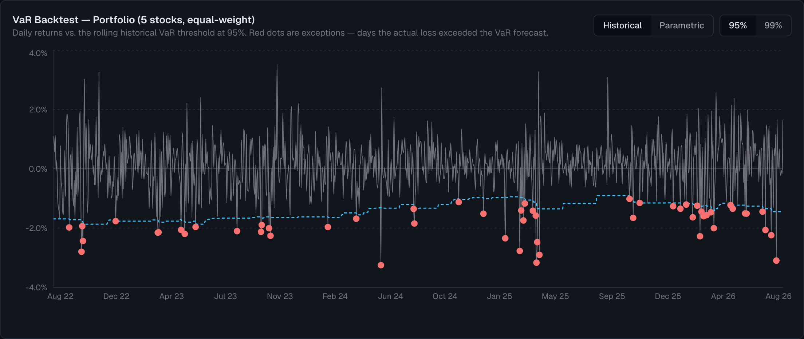

# Quant Lab

A backtesting, risk-analysis, and model-validation tool for a basket of
Canadian large-cap stocks — built to see how far a solo project can go in
being honest about what its own models get wrong, not just what they compute.



*The Model Validation tab backtesting its own VaR model — the red dots are
days the actual loss exceeded the model's forecast.*

**This is not investment advice**, not a production risk system, and not
wired up for live trading. See [Limitations](#limitations) and
[`MODEL_DOCUMENTATION.md`](./MODEL_DOCUMENTATION.md) before treating anything
here as more than a demonstration.

## What it does

Three tabs, one shared Python-to-JSON data pipeline underneath:

- **Strategies** — backtests four rules (1-day momentum, 12-month momentum,
  mean reversion, and a buy-and-hold benchmark) over ~51 stocks and a
  configurable transaction cost, with an interactive stock picker and
  start-date control that recompute every stat live.
- **Risk Dashboard** — volatility, Sharpe, max drawdown, historical VaR and
  Expected Shortfall, Beta/Alpha (CAPM), a correlation heatmap, rolling
  (time-varying) risk metrics, a Monte Carlo outcome projection, and a
  long-only Efficient Frontier optimizer (minimum-variance and max-Sharpe
  portfolios), all for any combination of the covered stocks.
- **Model Validation** — doesn't compute new metrics; it checks whether the
  ones above can be trusted. See below.

## The notable part

Most portfolio-analysis demos stop at computing metrics. This one also asks
whether they're right:

- **VaR backtesting** — a strictly out-of-sample rolling window, tested
  against what actually happened using the **Kupiec** (coverage) and
  **Christoffersen** (independence) likelihood-ratio tests, plus a **Basel
  traffic-light** classification.
- **The VaR model currently fails the Christoffersen test in all four
  method/confidence combinations tested** — exceptions cluster in time
  rather than scattering randomly, a real and specific finding, not a
  hypothetical caveat. See [`MODEL_DOCUMENTATION.md`](./MODEL_DOCUMENTATION.md#5-validation-results-actual-numbers-including-failures)
  for the actual numbers.
- **Historical stress testing** — replays four real crises (2008, the
  2014–16 oil crash, COVID, 2022's rate hikes) against the current stock
  selection, with mean-variance portfolio weights estimated strictly
  out-of-sample (3 years of prior data only, held fixed through the crisis).
  For the default selection, the "optimal" max-Sharpe portfolio
  underperforms a naive equal-weight blend of the same stocks in one of the
  four crises — concrete evidence for a caveat that's usually just asserted.

## Tech stack

- **Data**: Python, `pandas`, `numpy`, `scipy`, `yfinance` — run manually,
  not on a schedule (see [Limitations](#limitations)).
- **Frontend**: Next.js (App Router), TypeScript, Tailwind CSS, Recharts.
- **No database, no backend API.** Python writes static JSON into
  `web/public/`; Next.js reads it straight off disk. Every metric is computed
  **client-side** in the browser from that JSON, specifically so the
  start-date and stock-selection controls recompute instantly.

## Running it locally

Requires Python 3.10+ and Node 18+. From a clean clone:

**1. Set up the Python environment and regenerate the data** (the venv
directory is gitignored, so this step is needed even if you've run it
before on a different machine):

```bash
cd backtest
python3 -m venv venv
source venv/bin/activate
pip install pandas numpy scipy yfinance   # jupyter optional, only for exploring notebooks

python market_data.py          # -> web/public/market_data.json (run first; others read/reference it)
python momentum_backtest.py    # -> web/public/results.json
python risk_dashboard.py       # -> web/public/risk.json
python stress_data.py          # -> web/public/stress_data.json (a separate, longer 2005-2022 download)
python validation.py           # -> web/public/validation.json (also prints a console validation report)
```

**2. Run the frontend:**

```bash
cd web
npm install
npm run dev
```

Open [http://localhost:3000](http://localhost:3000). Re-running the Python
scripts and refreshing the page is the entire "update the data" workflow —
there's no build step in between.

## Limitations

Every feature states its own assumptions inline, on the page, next to the
numbers they affect. Two places collect the full picture:

- **[`MODEL_DOCUMENTATION.md`](./MODEL_DOCUMENTATION.md)** — methodology,
  assumptions, and data limitations for every model here, plus the actual
  validation results **including the tests that failed** (§5) and a table
  of known deficiencies with what would fix them (§6).
- **The site's own "Assumptions & Limitations" page** (linked from the
  footer on every tab) — a plain-language summary grouped by data/model/
  implementation limitations, with numbers read live from the generated
  JSON so it can't silently drift out of sync with the data.

The short version: the stock universe has real survivorship bias, `yfinance`
is an unofficial API with no SLA, the Efficient Frontier and Monte Carlo
projection assume the future looks like a chosen historical window (which
§5 of the model documentation shows isn't quite true), and there's no
automated test suite — correctness so far rests on mutation tests and
cross-checks run by hand during development.

## Roadmap

- **GARCH-style volatility modelling** — the constant-variance assumption
  behind parametric VaR and Monte Carlo is the most likely fix for the
  Christoffersen test failures above.
- **Multi-factor risk model** — replace the single-factor CAPM Beta/Alpha
  with something Fama-French-style.
- **Shrinkage / Black-Litterman for the Efficient Frontier** — address the
  mean-return input sensitivity that the stress tests already surface
  empirically.
- **Point-in-time index constituents** — would remove the survivorship bias
  described above, if a suitable free data source exists.
- **Scheduled CI regeneration** of the JSON data, so the "Data as of" stamp
  reflects something closer to a live feed.
- **An automated test suite**, porting the ad hoc mutation/closed-form
  checks used during development into something that runs on every change.
